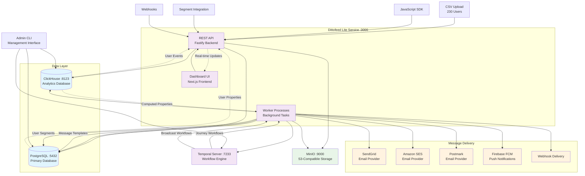

# Dittofeed (Krishna Bhumi Lead Nurturing Tool) - Architectural Data Flow Diagram

## System Overview

Dittofeed is an omni-channel customer engagement platform that enables automated user journeys, broadcasts, and message delivery across multiple channels. This document provides a comprehensive architectural overview of the data flow within the Krishna Bhumi Lead Nurturing Tool implementation.

## Core Architecture Components

### Services
- **Lite Service**: Unified application combining dashboard UI, API, and worker functionality
- **PostgreSQL**: Primary transactional database for application state
- **ClickHouse**: Analytics database for events and computed properties
- **Temporal**: Workflow orchestration engine for background tasks
- **Admin CLI**: Management and bootstrap utilities

### External Integrations
- **Email Providers**: SendGrid, Amazon SES, Postmark, Mailchimp
- **Data Sources**: CSV uploads, REST API, Segment integration
- **File Storage**: MinIO (S3-compatible) for blob storage

## Architectural Data Flow Diagram

## Detailed Component Descriptions

### 1. Data Ingestion Layer

#### CSV Upload Processing
- **Entry Point**: Dashboard UI file upload component
- **Processing**: API parses CSV and validates user data
- **Storage**: User properties stored in PostgreSQL `UserProperty` table
- **Events**: User creation events logged to ClickHouse `user_events_v2` table

#### API Ingestion
- **Endpoints**: REST API for user tracking and properties
- **Authentication**: API key-based authentication
- **Rate Limiting**: Implemented for API endpoints
- **Validation**: Schema validation for incoming data

### 2. Core Services

#### Lite Service (Port 3000)
**Components:**
- **Dashboard**: Next.js React application for user interface
- **API**: Fastify-based REST API server
- **Worker**: Background task processor

**Responsibilities:**
- User authentication and session management
- Template creation and management
- Segment definition and computation
- Journey builder interface
- Real-time analytics dashboard

#### PostgreSQL Database (Port 5432)
**Key Tables:**
- `UserProperty`: User attributes and profile data
- `UserPropertyAssignment`: Dynamic property assignments
- `Segment`: User segmentation definitions
- `Journey`: Automated workflow definitions
- `MessageTemplate`: Email/SMS templates
- `Broadcast`: One-time message campaigns
- `EmailProvider`: ESP configuration
- `AdminApiKey`: Authentication tokens

#### ClickHouse Database (Port 8123)
**Key Tables:**
- `user_events_v2`: All user behavioral events
- `computed_property_assignments_v2`: Calculated user properties
- `computed_property_state_v2`: Property computation state
- `resolved_segment_state`: Segment membership cache
- `user_group_assignments`: User grouping data

#### Temporal Workflow Engine (Port 7233)
**Workflow Types:**
- **Journey Workflows**: Multi-step user journey execution
- **Broadcast Workflows**: Mass message delivery
- **Compute Properties Workflows**: Background property calculation
- **Segment Processing**: Dynamic segment membership updates

### 3. Data Processing Workflows

#### User Data Processing Flow
1. **Ingestion**: CSV/API data received by Lite service
2. **Validation**: Schema validation and data sanitization
3. **Storage**: User properties written to PostgreSQL
4. **Event Logging**: User creation/update events to ClickHouse
5. **Property Computation**: Temporal workflows trigger computed property updates
6. **Segment Assignment**: Dynamic segment membership calculation

#### Journey Execution Flow
1. **Trigger**: User enters journey based on segment membership or event
2. **Temporal Workflow**: Journey workflow started for user
3. **Step Processing**: Each journey step processed sequentially
4. **Message Generation**: Templates rendered with user data
5. **Delivery**: Messages sent via configured providers
6. **Analytics**: Delivery status and engagement tracked

#### Broadcast Processing Flow
1. **Audience Selection**: Target segment identified
2. **Message Preparation**: Template rendered for all users
3. **Batch Processing**: Users processed in configurable batches
4. **Provider Distribution**: Messages distributed across ESPs
5. **Status Tracking**: Delivery and engagement monitoring

### 4. Message Delivery Channels

#### Email Providers
- **SendGrid**: Primary ESP with advanced features
- **Amazon SES**: Cost-effective bulk email delivery
- **Postmark**: Transactional email specialization
- **Configuration**: Provider credentials stored in PostgreSQL `EmailProvider` table

#### Push Notifications
- **Firebase FCM**: Mobile push notification delivery
- **Configuration**: FCM credentials managed via secrets

#### Webhooks
- **Custom Integrations**: HTTP-based message delivery
- **Retry Logic**: Automatic retry with exponential backoff
- **Authentication**: Support for various auth methods

### 5. Inter-Service Communication

#### Database Connections
- **PostgreSQL**: Direct connections from Lite service and Admin CLI
- **ClickHouse**: Optimized for high-volume event ingestion and analytics queries
- **Connection Pooling**: Managed connection pools for performance

#### Temporal Integration
- **Client Libraries**: TypeScript clients for workflow management
- **Task Queues**: Separate queues for different workflow types
- **Monitoring**: Built-in workflow monitoring and alerting

#### API Communication
- **Internal**: Direct function calls within Lite service
- **External**: RESTful APIs for client integrations
- **Authentication**: JWT tokens and API keys

## Data Flow Scenarios

### Scenario 1: CSV User Upload (230 Users)
1. User uploads CSV file via Dashboard
2. API validates and parses CSV data
3. User properties batch-inserted into PostgreSQL
4. User creation events logged to ClickHouse
5. Computed properties workflow triggered
6. Segment memberships recalculated
7. Eligible users enter relevant journeys

### Scenario 2: Automated Journey Execution
1. User performs tracked action (e.g., website visit)
2. Event logged to ClickHouse via API
3. Computed properties updated by Temporal workflow
4. Segment membership evaluated
5. Journey entry conditions checked
6. Temporal journey workflow started
7. Message templates rendered and sent
8. Delivery status tracked and reported

### Scenario 3: Broadcast Campaign
1. Marketing team creates broadcast via Dashboard
2. Target segment selected and validated
3. Message template designed and tested
4. Broadcast workflow scheduled in Temporal
5. User batches processed sequentially
6. Messages delivered via configured providers
7. Analytics and reporting updated real-time

## Performance and Scalability Considerations

### Database Optimization
- **PostgreSQL**: Indexed on frequently queried columns (userId, workspaceId)
- **ClickHouse**: Optimized for time-series queries and aggregations
- **Connection Pooling**: Managed pools prevent connection exhaustion

### Workflow Scalability
- **Temporal**: Horizontally scalable workflow execution
- **Batch Processing**: Configurable batch sizes for large operations
- **Queue Management**: Separate queues prevent workflow interference

### Caching Strategy
- **Computed Properties**: Cached in ClickHouse for fast access
- **Segment Memberships**: Materialized views for performance
- **Template Rendering**: Compiled templates cached in memory

## Security Architecture

### Authentication & Authorization
- **JWT Tokens**: Secure API authentication
- **API Keys**: Programmatic access control
- **Role-Based Access**: Workspace-level permissions

### Data Protection
- **Encryption**: Sensitive data encrypted at rest and in transit
- **Secrets Management**: Provider credentials stored securely
- **Audit Logging**: All administrative actions logged

### Network Security
- **Docker Networks**: Isolated container communication
- **Port Exposure**: Minimal external port exposure
- **Environment Variables**: Secure configuration management

## Monitoring and Observability

### Application Monitoring
- **Health Checks**: Endpoint monitoring for all services
- **Performance Metrics**: Response times and throughput tracking
- **Error Logging**: Comprehensive error tracking and alerting

### Workflow Monitoring
- **Temporal UI**: Visual workflow execution monitoring
- **Failed Tasks**: Automatic retry and failure notification
- **Performance Tracking**: Workflow execution time analysis

### Database Monitoring
- **Query Performance**: Slow query identification and optimization
- **Resource Usage**: CPU, memory, and disk utilization tracking
- **Backup Status**: Automated backup verification

## Deployment Architecture

The system is deployed using Docker Compose with the following characteristics:

- **Container Orchestration**: Docker Compose for local development
- **Service Discovery**: Docker internal networking
- **Volume Management**: Persistent storage for databases
- **Environment Configuration**: Environment-based configuration management
- **Scaling**: Horizontal scaling support for stateless services

This architecture provides a robust, scalable foundation for the Krishna Bhumi Lead Nurturing Tool, supporting the complete lifecycle from user data ingestion through automated journey execution and message delivery.